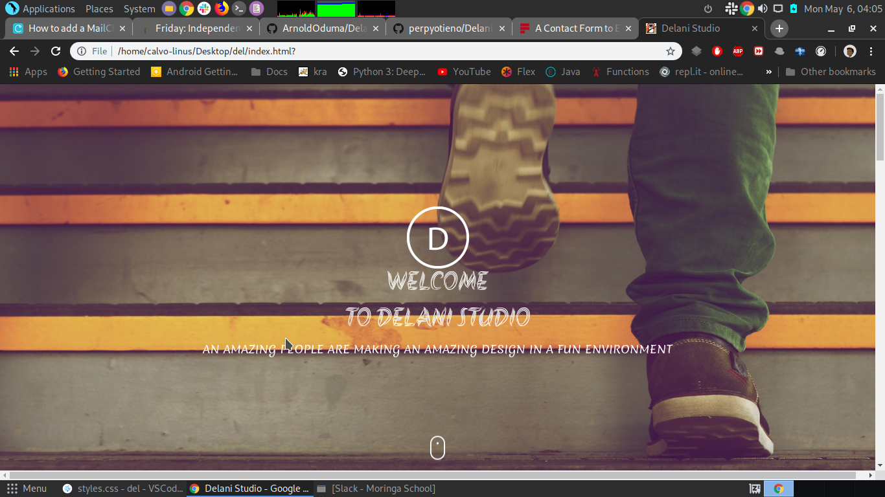

:satisfied:
# DELANI STUDIO
#### This project interlinks clients to software developers, Sunday May 5 2019 
#### By **OMONGE CALVINCE**&trade;

## Description
This is a project that details what Delani Studio does and their works. Additionally, it allows users to send messages and receive email confirmations n receival of the messages by the company.
## Project live site
  This is the live .[ Click for the demo](https://calvince.github.io/Delani-Studio/)

## Setup instructions
* Clone the program from [Online repo](https://github.com/calvince/Delani-Studio)
* Click on the green button to clone or download

## Behavior Driven Development
<table>
    <tr>
      <th>Behavior</th> 
      <th>Input</th> 
      <th>Output</th>   
    </tr>
    <tr>
        <td>Enter your name</td>
        <td>['Calvince']</td>
        <td>name = 'calvince'</td>
    </tr>
    <tr>
        <td>Enter Email && Message</td>
        <td>['Email','Message']</td>
        <td>Email && Message</td>
    </tr>
    <tr>
        <td>Submit</td>
        <td>Email && Message</td>
        <td>Thank you Calvince, details received</td>
    </tr>
    <tr>
        <td>Sum of two values<= third value </td>
        <td>[1,2,5]</td>
        <td>No triangle</td>
    </tr>    
</table>

## Technologies Used
* HTML
* CSS
* Bootsrap
* JQuery
* Javascript

## Support and contact details
contact me @ calmosh1421@gmail.com
### License
The project is under[MIT license](https://github.com/calvince/Delani-Studio/blob/master/LICENSE)
Copyright &copy; 2019.All rigths reservedg
  